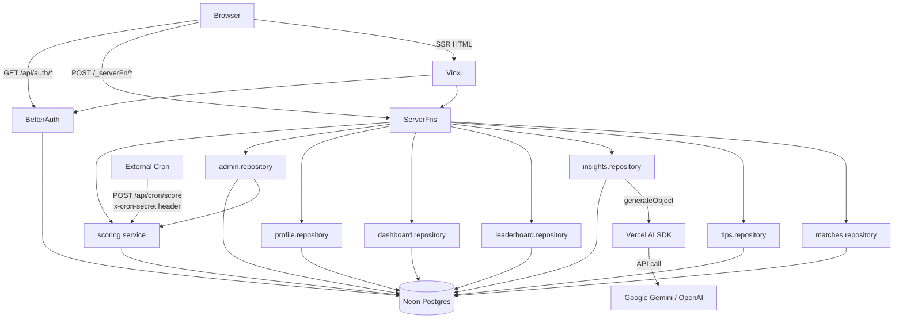

# Kickoff — Architectural Overview

> Reverse-engineered deep dive: how the system was built, why decisions were made, and how the pieces fit together.

---

## 1. Executive Summary

Kickoff is a **production-grade sports tipping application** for FIFA World Cup 2026. Users predict match scores; points accumulate on a live leaderboard. An AI co-pilot generates LLM-powered pre-match analysis on demand.

The architecture is a **modular monolith with SSR** built on TanStack Start. There is no separate API server — the same Node.js process serves HTML, handles server functions (RPC), and talks to the database. The team deliberately chose a tight vertical stack: Neon serverless Postgres, Drizzle ORM, Better Auth, TanStack Router + Query, Vercel AI SDK, all wired together in one repo with one build artifact.

Engineering maturity is high for a solo/small-team project: consistent layering, good test coverage, typed end-to-end, ADRs for decisions, working CI baseline.

---

## 2. Architecture Overview

```
┌─────────────────────────────────────────────────────────────────┐
│                        Browser                                  │
│  React 19  •  TanStack Router  •  TanStack Query  •  Tailwind  │
│  authClient.useSession()  •  useMutation (optimistic)           │
└────────────────────────┬────────────────────────────────────────┘
                         │  HTTP  (SSR HTML  +  _serverFn RPC)
┌────────────────────────▼────────────────────────────────────────┐
│                   Node.js / Vinxi Server                        │
│  TanStack Start  •  Streaming SSR  •  createServerFn handlers   │
│  Better Auth session validation  •  Admin guard (ADMIN_USER_IDS)│
│  Vercel AI SDK  •  generateObject()  •  zod schema validation   │
└────────────────────────┬────────────────────────────────────────┘
                         │  neon-http  (HTTP/2 Postgres wire)
┌────────────────────────▼────────────────────────────────────────┐
│              Neon Serverless Postgres                           │
│  matches  •  user/session/account/verification (Better Auth)    │
│  tips  •  ai_match_insights                                     │
└─────────────────────────────────────────────────────────────────┘
         ↑ also queried by  scheduled POST /api/cron/score
         ↑ also written by  AI SDK (insight cache)
         ↑ also seeded by   scripts/seed-dev.ts
```

**Architectural style:** Hybrid SSR + SPA (modular monolith). The server renders the initial HTML shell with data serialised into it; subsequent navigations are client-side SPA transitions without full reloads. Auth-triggered navigations (`window.location.href`) force a full reload to give SSR access to the session cookie.

---

## 3. Runtime Request Lifecycle

### First page load — `/matches/abc-123`

```
Browser GET /matches/abc-123
  │
  ▼ Vinxi server (Node.js)
  TanStack Start SSR handler
    │
    ├─ Route loader runs server-side:
    │    queryClient.ensureQueryData(matchQueryOptions('abc-123'))
    │      → matchesRepository.getById('abc-123')    [DB query via neon-http]
    │    queryClient.ensureQueryData(insightQueryOptions('abc-123'))
    │      → insightsRepository.getCached('abc-123') [DB query]
    │    queryClient.ensureQueryData(userTipQueryOptions('abc-123'))
    │      → auth.api.getSession({ headers })         [session lookup]
    │      → tipsRepository.getUserTip(userId, matchId)
    │
    ├─ React renders component tree to HTML stream
    │    QueryClient state serialised into __QUERY_CLIENT_STATE__ window var
    │
    └─ HTML + inline state + JS bundle references sent to browser

Browser receives HTML — page is immediately readable (no loading spinners)
  │
  ▼ Client hydration  (entry-client.tsx)
  hydrateRoot(document, <StrictMode><StartClient /></StrictMode>)
    │
    └─ TanStack Query rehydrates from __QUERY_CLIENT_STATE__
       No network requests needed — data already in cache
```

### Subsequent SPA navigation — clicking another match link

```
User clicks /matches/xyz-456
  │
  ▼ TanStack Router intercepts (client-side)
  Route loader runs CLIENT-side:
    queryClient.ensureQueryData(matchQueryOptions('xyz-456'))
      → if stale: POST /_serverFn/getMatchByIdFn → server → DB → JSON
      → if fresh: served from QueryClient cache immediately

  React updates component tree — no full page reload
```

### Tip submission

```
User fills score inputs, clicks "Lock in Tip"
  │
  ▼ TipForm useMutation.onMutate()
  Optimistic update:
    queryClient.setQueryData(userTipKey, { tip: { predictedHomeScore: 2, ... } })
    Component immediately re-renders showing "Your tip: 2 – 1"
  │
  ▼ POST /_serverFn/submitTipFn
  Server:
    auth.api.getSession() → validate user
    matchesRepository.getById() → check status !== 'completed'
    tipsRepository.submit() → INSERT into tips table
    returns { tipId }
  │
  ▼ onSettled: queryClient.invalidateQueries(userTipKey)
  Refetch confirms server state; tip remains locked
  onError: rolls back optimistic state, shows error
```

---

## 4. Tech Stack

### Frontend

| Technology | Purpose | Why chosen | Tradeoffs | Alternatives |
|---|---|---|---|---|
| **React 19** | UI component model | Ecosystem, concurrent features | Learning curve, bundle size | Solid.js, Svelte |
| **TanStack Router** | File-based routing with full TypeScript | Type-safe routes, SSR loaders, preloading | Newer, smaller community than Next.js | Next.js App Router, Remix |
| **TanStack Start** | SSR framework on top of TanStack Router | Keeps same mental model as client router, Vinxi-powered | Very new (v1.x), some rough edges | Next.js, Remix, Nuxt |
| **TanStack Query** | Server-state cache | Normalised cache, stale-while-revalidate, optimistic updates | Adds complexity vs. simple fetch | SWR, Jotai + fetch |
| **Tailwind CSS 3** | Styling | Utility-first, no CSS-in-JS overhead | Verbose JSX, no design tokens out of box | CSS Modules, vanilla-extract |

### Backend / Runtime

| Technology | Purpose | Why chosen | Tradeoffs |
|---|---|---|---|
| **Vinxi** | Meta-framework runtime | Powers TanStack Start; unified client + server build | Very new, limited production case studies |
| **`createServerFn`** | RPC from client to server | Type-safe, no REST boilerplate, co-located with feature | Non-standard; harder to expose as a public API |
| **Better Auth** | Session-based auth | Self-hosted, drizzle adapter, no vendor lock-in | You handle infra vs. Clerk/Auth0 |
| **Zod v4** | Runtime validation in server fns | Pairs with TypeScript; clear error messages | Bundle weight (v4 is leaner than v3) |

### Data

| Technology | Purpose | Why chosen | Tradeoffs |
|---|---|---|---|
| **Neon Serverless Postgres** | Primary database | HTTP driver works in edge/serverless | Latency on cold start; HTTP slower than binary protocol |
| **Drizzle ORM** | Type-safe query builder | Thin layer, migrations, no magic, 1:1 with SQL | Less battle-tested than Prisma |
| **`neon-http` driver** | Postgres-over-HTTP | Works in Vercel Edge, Cloudflare Workers | No streaming, cursors, or long transactions |

### AI

| Technology | Purpose | Why chosen |
|---|---|---|
| **Vercel AI SDK (`ai`)** | LLM client abstraction | Provider-agnostic: swap Google ↔ OpenAI via env var; `generateObject` gives structured output |
| **`@ai-sdk/google` + `@ai-sdk/openai`** | Provider SDKs | Both plugged in; default is Gemini Flash (fast + cheap) |
| **DB-cached insights** | Avoid repeat LLM calls | `ai_match_insights` stores response; `getOrGenerate` is cache-first |

### Tooling

| Technology | Purpose |
|---|---|
| **Vite 8 + Rolldown** | Bundler — Rolldown (Rust-based) replaces Rollup inside Vite 8 for faster builds |
| **Vitest 3** | Unit tests — same config as Vite, no Jest transform setup needed |
| **Playwright** | E2E tests — browser automation, `globalSetup` for DB seeding |
| **happy-dom** | Lightweight JSDOM alternative for Vitest |
| **tsx** | TypeScript execution for seed scripts without a compile step |
| **drizzle-kit** | Schema migrations and Drizzle Studio UI |

---

## 5. Repository Structure

```
kickoff/
├── src/
│   ├── ai/                    ← cross-cutting AI model factory
│   ├── auth/                  ← cross-cutting auth (server config + client hooks)
│   ├── db/                    ← cross-cutting DB client + schema
│   │
│   ├── features/              ← VERTICAL SLICES — one folder per domain concept
│   │   ├── matches/           ← repository + server fn + query options + tests
│   │   ├── tips/              ← repository + server fn + scoring logic + tests
│   │   ├── insights/          ← repository (hides AI complexity) + server fn
│   │   ├── leaderboard/       ← repository + server fn + query options
│   │   ├── dashboard/         ← aggregation repository + server fn
│   │   ├── profile/           ← repository + server fn
│   │   ├── scoring/           ← batch scoring service (cron use-case)
│   │   └── admin/             ← admin repository + server fn (admin-gated)
│   │
│   ├── routes/                ← THIN VIEW LAYER — file-based pages
│   │   ├── __root.tsx         ← root layout, Navbar
│   │   ├── index.tsx          ← dashboard page
│   │   ├── matches/           ← fixture list + match detail
│   │   ├── admin.tsx          ← admin UI
│   │   ├── login.tsx          ← auth forms
│   │   ├── profile.tsx
│   │   ├── leaderboard.tsx
│   │   └── api/               ← raw HTTP handlers (auth catch-all, cron)
│   │
│   └── components/            ← reusable UI (TipForm, RouteError)
│
├── e2e/                       ← Playwright specs (one file per feature)
├── scripts/                   ← seed scripts (dev fixtures, API-Football)
└── docs/
    ├── adr/                   ← Architecture Decision Records
    ├── architecture.md        ← this file
    └── backlog.md
```

**Pattern:** Feature-based **vertical slice architecture** with a thin shared infrastructure layer. Each feature slice owns everything from DB query to server function to query options. Routes contain no business logic — only render calls and `ensureQueryData` invocations.

This mirrors the **Deep Module** pattern from *A Philosophy of Software Design* (Ousterhout): modules expose a small interface (`getOrGenerate(matchId)`) that hides large implementation complexity (cache lookup → DB fetch → LLM call → DB write).

---

## 6. Frontend Architecture

### Routing

TanStack Router uses file-based routing. `routeTree.gen.ts` is auto-generated by the Vite plugin — never edited by hand. The route tree is fully typed: `<Link to="/matches/$matchId">` is a compile error if the route doesn't exist.

```
Route hierarchy:
__root (layout: Navbar + QueryClientProvider)
  ├── /                      (index — dashboard)
  ├── /login
  ├── /matches/              (fixture list)
  │   └── /matches/$matchId  (match detail)
  ├── /leaderboard
  ├── /profile
  ├── /admin
  └── /api/
      ├── /api/auth/$        (Better Auth catch-all)
      └── /api/cron/score    (scoring trigger)
```

### Rendering Strategy

**SSR + Client Hydration hybrid.** Every route has a `loader` that pre-fetches data into the QueryClient on the server. The serialised cache is embedded in the HTML response. On the client, `hydrateRoot` picks up the existing DOM without re-fetching. Subsequent navigations are SPA (loader runs client-side against server functions).

Key invariant: **loaders must `return` the result of `ensureQueryData`**. A void loader populates the server-side QueryClient but that state is never serialised to the client — the client starts with an empty cache and triggers a second fetch. This is documented in CLAUDE.md.

### Data Fetching

```
Route Loader (server-side on first load, client-side on navigation)
  └── queryClient.ensureQueryData(featureQueryOptions)
        └── featureQueryFn → createServerFn → repository → DB

Component
  └── Route.useLoaderData()          ← synchronous, from cache
  └── useQuery({ initialData })      ← reactive, refetches when stale
  └── useMutation → server fn → DB  ← with optimistic updates
```

### Optimistic Updates

`TipForm` is the canonical example:

1. `onMutate`: snapshot previous state, write optimistic tip to cache → instant UI update
2. `mutationFn`: POST to server fn
3. `onError`: restore snapshot (rollback)
4. `onSettled`: `invalidateQueries` → refetch to confirm server state

### Auth Flow

```
Unauthenticated user → /login
  → fills form → authClient.signIn.email()
  → window.location.href = '/'    ← full reload (not navigate())
  → SSR picks up session cookie
  → HTML arrives with session baked in
  → Navbar shows user name from first paint — no flash
```

`window.location.href` is used instead of TanStack Router's `navigate()` because `useSession()` is a client-side reactive hook. After a SPA navigation it has stale `null` state and takes ~1s to refetch. A full reload lets SSR read the cookie and serve the correct state immediately.

---

## 7. Backend Architecture

### API Design: Server Functions (RPC, not REST)

There are no REST routes. Every data operation is a `createServerFn` call. The client-side stub calls `POST /_serverFn/<fnName>` with a JSON body; the server runs the handler and returns JSON.

```typescript
export const getMatchesFn = createServerFn({ method: 'GET' })
  .handler(() => matchesRepository.getAll());
```

Trade-off: you gain type safety end-to-end and zero boilerplate; you lose the ability to call these from a mobile client or external service without using the same framework.

### Layering

```
Route loader / component
  └── server fn  (auth check + input validation with Zod)
        └── repository  (SQL queries / LLM calls)
              └── db client  (neon-http → Neon Postgres)
```

Auth checks live exclusively in the server fn layer. Repositories are pure data functions — easily unit-tested by mocking the DB client.

### Scoring Pipeline

```
calculatePoints()         → pure function, no I/O
tipsRepository.submit()   → INSERT only
scoreCompletedMatches()   → fetch completed matches
                             → for each: find unscored tips (scoredAt IS NULL)
                             → calculatePoints() → UPDATE tip
                             → recalculate user.points
adminRepository.updateMatch() → UPDATE match + call scoreCompletedMatches()
POST /api/cron/score      → validate x-cron-secret header → scoreCompletedMatches()
```

`scoreCompletedMatches()` is **idempotent** — tips with `scoredAt IS NOT NULL` are skipped. Safe to call multiple times.

### AI Integration

```
insightsRepository.getOrGenerate(matchId):
  1. SELECT FROM ai_match_insights WHERE match_id = $1
  2. if found → return cached  (0 LLM calls)
  3. else:
       matchesRepository.getById(matchId)         ← get team names
       generateObject({ model, schema, prompt })  ← Vercel AI SDK
       INSERT INTO ai_match_insights (...)         ← persist
       return saved
```

`generateObject` enforces a Zod schema on the LLM response — if the model returns malformed JSON or violates the schema, Vercel AI SDK retries automatically. The `AI_PROVIDER` env var selects Google Gemini (default) or OpenAI; `AI_MODEL` overrides the model ID.

---

## 8. Infrastructure

### Local Development

```bash
npm run dev       # Vite + Vinxi: SSR + HMR in one process on port 5173
                  # strictPort: true — fails fast if port is taken
npm run db:push   # push schema changes to Neon (dev)
npm run db:seed:dev  # seed 72 group stage fixtures
```

No Docker required — Neon is always remote. The `--env-file=.env` flag on seed scripts loads env vars without a dotenv library.

### Build

```bash
npm run build    # Rolldown bundles client (dist/client/) + server (dist/server/)
npm run start    # node .output/server/index.mjs
```

### Secrets

All secrets live in `.env` (gitignored):

| Variable | Purpose |
|---|---|
| `DATABASE_URL` | Neon connection string |
| `BETTER_AUTH_SECRET` | Session signing key |
| `BETTER_AUTH_URL` | Must match the dev server port (5173) |
| `CRON_SECRET` | Validates `x-cron-secret` header on scoring endpoint |
| `ADMIN_USER_IDS` | Comma-separated user IDs for admin access |
| `AI_PROVIDER` / `AI_MODEL` | LLM provider selection |
| `GOOGLE_GENERATIVE_AI_API_KEY` | Gemini API key |
| `OPENAI_API_KEY` | OpenAI API key (if `AI_PROVIDER=openai`) |
| `GITHUB_CLIENT_ID/SECRET` | GitHub OAuth (optional) |
| `GOOGLE_CLIENT_ID/SECRET` | Google OAuth (optional) |

### CI/CD

No pipeline is configured. The project is structured to support CI easily — all test commands are `npm run test` / `npm run test:e2e` — but automation has not been wired up yet.

---

## 9. Engineering Quality Assessment

| Dimension | Assessment |
|---|---|
| **Architectural consistency** | Deep module pattern applied uniformly across all 8 feature slices |
| **Type safety** | End-to-end: DB schema → server fn → client; no visible `any` |
| **Test coverage** | Unit tests for all repositories and scoring logic; E2E for all features including admin auth, cron security, and profile authenticated paths |
| **Developer experience** | One-command dev, co-located tests, CLAUDE.md documents the why |
| **Observability** | No structured logging, no error tracking, no metrics |
| **CI/CD** | No pipeline; tests run locally only |
| **Security** | Sessions correct, cron secret, admin guard; no rate limiting, no CSP headers |
| **Scalability** | Neon HTTP is serverless-friendly; scoring is sequential O(n tips) |
| **Operational maturity** | No health endpoint, no graceful shutdown, no alerting |

**Strengths:**
- Layering is rigorous and never violated (no DB imports in routes, no business logic in routes)
- Optimistic updates implemented correctly with rollback
- `globalSetup` DB seeding pattern for E2E is clean and portable
- ADRs document *why* decisions were made, not just what

**Risks:**
- `scoreCompletedMatches()` is synchronous and sequential — slow at scale
- No CI means regressions could ship undetected
- `ai_match_insights` cache has no invalidation strategy — stale insights persist forever
- No rate limiting on the AI endpoint
- `ADMIN_USER_IDS` as a comma-separated env var is fragile at scale

---

## 10. Historical Evolution

Based on git history and ADRs, the likely build order:

```
Phase 1 — Scaffolding
  Vinxi + TanStack Router + Drizzle schema + Better Auth
  Basic matches list + match detail

Phase 2 — Core Feature
  Tip submission with optimistic updates
  Scoring logic (calculatePoints + scoreCompletedMatches)
  Cron endpoint secured with CRON_SECRET

Phase 3 — AI Feature
  Vercel AI SDK integration
  insightsRepository with DB cache
  AI co-pilot UI on match detail

Phase 4 — Social Features
  Leaderboard, Profile, Dashboard

Phase 5 — Quality Pass
  Unit tests for all repositories
  E2E tests (home, login, matches, profile, tip-form)
  ADRs written retrospectively

Phase 6 — Hardening
  Fix auth session cookie (server.handlers.ANY pattern)
  Build fix (auth.client → authClient rename)
  Navbar flash fix (window.location.href)
  Admin UI (ADMIN_USER_IDS gate)
  Playwright globalSetup for DB seeding
  Port pinned with strictPort
```

---

## 11. Key Lessons

**1. Server functions as the API layer**
`createServerFn` eliminates REST ceremony (no URL design, no controller, no serialisation boilerplate). The trade-off is coupling: the client must use the same framework. This is a good trade for a single-team monolith; it breaks down if you need a public API or mobile clients.

**2. Deep modules hide complexity from callers**
`insightsRepository.getOrGenerate(matchId)` is a single call for the caller. Behind it: a DB read, a conditional LLM call, structured output validation, and a DB write. This is the correct abstraction boundary — the caller never needs to know whether the answer came from cache or the LLM.

**3. Loaders must return data**
`await queryClient.ensureQueryData(...)` with no `return` populates the server-side QueryClient, but that state is never serialised to the client. The client starts with an empty cache and triggers a second fetch. This class of bug is invisible without understanding the SSR hydration model.

**4. Optimistic updates require a rollback strategy**
The `TipForm` mutation shows the full pattern: snapshot → optimistic write → server call → rollback on error → invalidate on settle. Skipping rollback leaves the UI in a permanently wrong state after a server error.

**5. Filename conventions are architecture**
Renaming `auth.client.ts` to `authClient.ts` fixed the production build. The `.client.` naming tells TanStack Start's bundler "this file is browser-only." When that convention is applied to an isomorphic module, it creates a false constraint the bundler enforces at build time.

---

## 12. Suggested Improvements

**High priority**
- Add GitHub Actions CI — `npm run test` + `npm run build` on every PR; E2E on `main` merges
- Rate-limit the AI co-pilot endpoint — a per-user cooldown prevents accidental LLM cost overruns
- Add structured logging (`pino`) with request IDs — currently errors are swallowed silently

**Medium priority**
- Paginate `scoreCompletedMatches()` — process in chunks; the current sequential loop blocks the event loop for large tournaments
- Add insight TTL — regenerate insights older than 24h pre-kickoff
- Add a health endpoint — `GET /healthz → { ok: true }` for deployment checks

**Low priority**
- Admin audit log — record who changed which score and when

See [docs/backlog.md](../docs/backlog.md) for implementation detail on each item.

---

## 13. Component Interaction Map



---

## Glossary

| Term | Definition |
|---|---|
| **Server Function** | `createServerFn` — runs server-side but called from client code; TanStack Start generates the HTTP stub automatically |
| **Deep Module** | A module with a simple interface hiding complex implementation; the guiding architectural principle of this codebase |
| **Optimistic Update** | Writing the expected result to the client cache immediately, before the server confirms, to give instant UI feedback |
| **Hydration** | Attaching React's event system to server-rendered HTML on the client |
| **staleTime** | TanStack Query setting controlling how long cached data is considered fresh before a background refetch |
| **Vinxi** | The meta-framework runtime TanStack Start builds on; handles bundling both client and server and the SSR request lifecycle |
| **neon-http** | Neon's Postgres driver that sends queries over HTTPS instead of TCP — makes Postgres work in serverless environments |
| **ADR** | Architecture Decision Record — a short document capturing *why* a decision was made, not just what was decided |
| **Vertical Slice** | A feature module that owns its full stack from DB query to UI, rather than grouping by technical layer |
